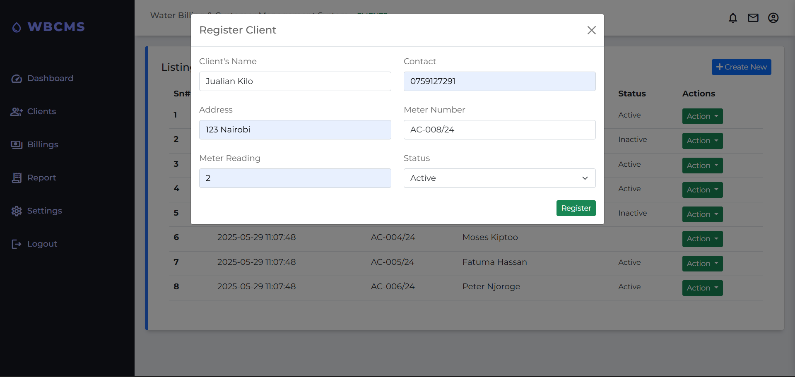
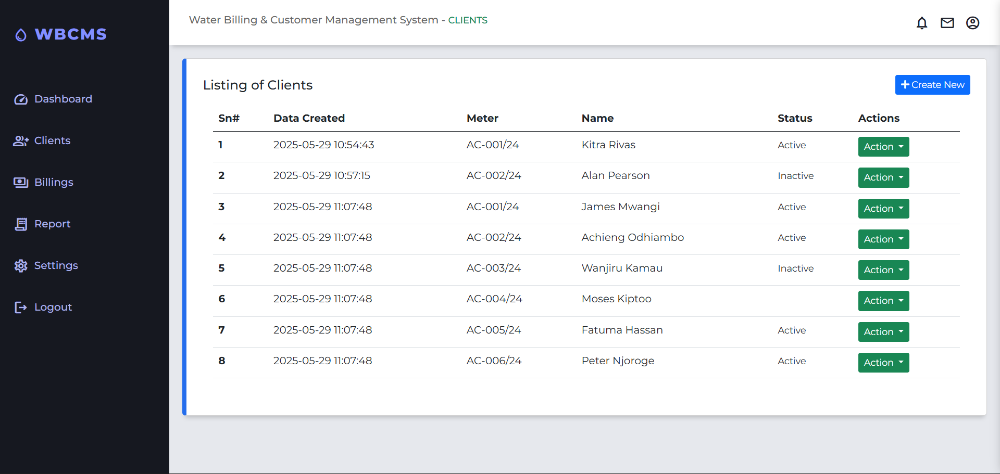
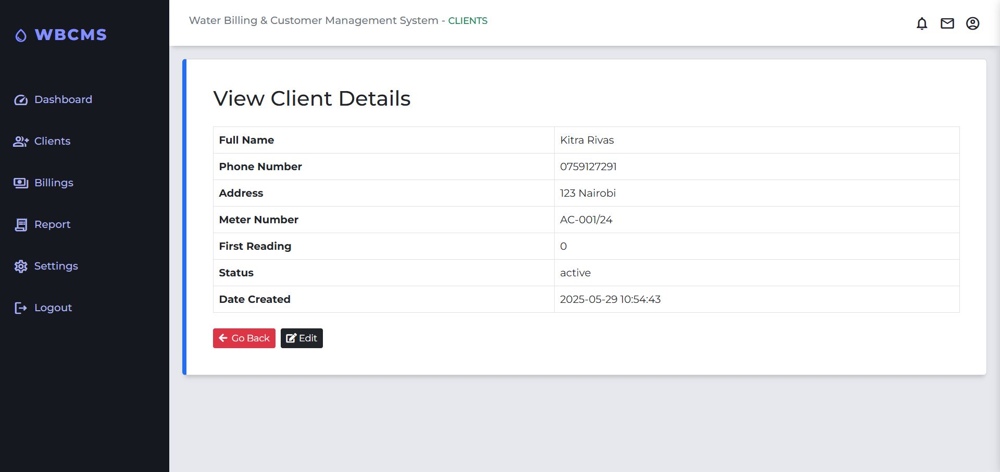

# Water Billing & Customer Management System

## Tech Stack
- **Backend:** PHP `(vanilla)`, MySQL
- **Frontend:** HTML, Bootstrap 5, JavaScript
- **Server:** Apache (XAMPP)
- **Database:** MySQL

## Features
- Client registration with unique account number generation (format: AC-###/YYYY)
- Manage client information (name, phone, address, meter readings, status)
- Automatic generation of sequential account numbers per year
- Display client list with detailed info
- Status management (active, inactive, pending)
- Responsive UI with Bootstrap modals and forms
- Meter reading tracking for billing

## Screenshots

### 1. App Login

### 2. Registration

### 3. Dashboard Overview

### 4. Client Registration Modal

### 5. Clients List Page

### 6. View client data

### 7. Billing

### 8. Reports

### 9. System settings

