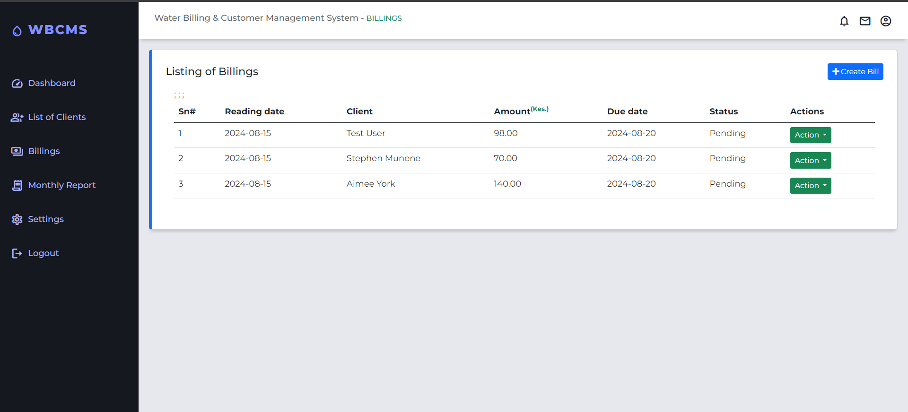

## WBCMS

###### **`Water Billing and Customer Management`** (Web-based application)

- **`WBCMS`** is a robust system designed to facilitate the management of water billing and customer data for utility companies. 
- The application automates the entire billing process, from client registration to the generation of detailed reports, making it easier to `manage and track water usage and payments`.

### Features
1. **Create account User**: Add new user accounts with customizable access levels.
2. **Create new Client**: Manage client data with full CRUD operations.
3. **Create new Billing**: Generate water bills with automatic charge calculations.
4. **Generate Reports**: Summarize billing data for selected months with detailed reports.


### Tools
- **Backend Development**: The application’s backend is built using **PHP** *`(vanilla)`* to handle logic, 
    - while **MySQL** is used for secure and efficient data storage and retrieval.
- **Frontend Development**: The frontend interface is developed using HTML, CSS (Bootstrap), and JavaScript, ensuring a responsive and user-friendly experience across different devices and screen sizes.


<details>
  <summary style="font-weight: bold; font-size: 1.2em; color: red;">Application Screenshots</summary>

  <h3 style="margin-top: 20px; font-size: 1.5em; color: #333;">Desktop View</h3>

  <!-- First Row -->
  <div style="display: flex; justify-content: space-between; margin-bottom: 20px;">
    <div style="flex: 1; margin-right: 10px;">
      
      <p style="text-align: center; margin-top: 10px; font-size: 0.9em; color: #666;">Login Page</p>
    </div>
    <div style="flex: 1;">
      
      <p style="text-align: center; margin-top: 10px; font-size: 0.9em; color: #666;">Main Dashboard</p>
    </div>
  </div>

  <!-- Second Row -->
  <div style="display: flex; justify-content: space-between; margin-bottom: 20px;">
    <div style="flex: 1; margin-right: 10px;">
      
      <p style="text-align: center; margin-top: 10px; font-size: 0.9em; color: #666;">Listing of Clients</p>
    </div>
    <div style="flex: 1;">
      
      <p style="text-align: center; margin-top: 10px; font-size: 0.9em; color: #666;">Listing of Billings</p>
    </div>
  </div>
   <h3 style="margin-top: 20px; font-size: 1.5em; color: #333;">Tablet View</h3>
  <!-- First Row -->
  <div style="display: flex; justify-content: space-between; margin-bottom: 20px;">
    <div style="flex: 1; margin-right: 10px;">
      
      <p style="text-align: center; margin-top: 10px; font-size: 0.9em; color: #666;">Dashboard View</p>
    </div>
    <div style="flex: 1;">
      
      <p style="text-align: center; margin-top: 10px; font-size: 0.9em; color: #666;">Listing of clients</p>
    </div>
  </div>

   <h3 style="margin-top: 20px; font-size: 1.5em; color: #333;">Mobile View</h3>

   <!-- Second Row -->
  <div style="display: flex; justify-content: space-between; margin-bottom: 20px;">
    <div style="flex: 1; margin-right: 10px;">
      
      <p style="text-align: center; margin-top: 10px; font-size: 0.9em; color: #666;">Mobile view</p>
    </div>
    <div style="flex: 1;">
      
      <p style="text-align: center; margin-top: 10px; font-size: 0.9em; color: #666;">Mobile view </p>
    </div>
  </div>

</details>

### Setup & Run Project

#### Prerequisites
1. *`XAMPP`*: Install a local server environment to run PHP and MySQL.
2. *`Git`*: Install Git to clone the project repository.
3. *`Web browser`*: Use a modern web browser like ``Chrome``.

#### Installation Steps

1. **Clone the Repository**:
   - Open a terminal, navigate to the *`htdocs`* directory inside your *`xampp`* directory, and run:
    ```bash
     git clone https://github.com/username/WBCMS.git
    ```

2. **Import the Database**:
   - Open *`phpMyAdmin`* in your browser.
   - Create a new database named *`wbcms_db`*.
   - Import the SQL file located in the project's `database` folder.

3. **Run the Project**:
   - Open your browser and navigate to:
    ```bash
     http://localhost/wbcms/
    ```


