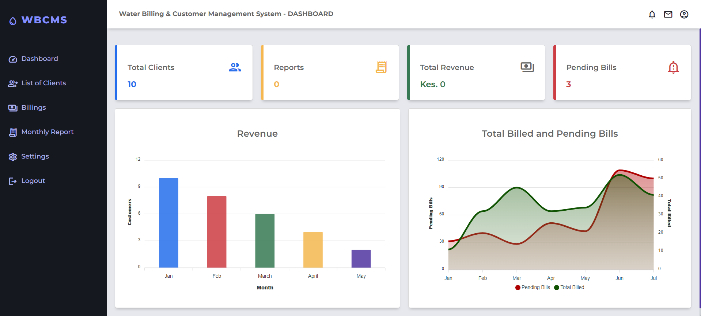

## Water Billing and Customer Management System

- This is a web-based application designed to streamline water usage `tracking`, `billing`, and `customer management` processes.
- It allows users to register for water connections, record monthly meter readings, generate bills, process payments, and generate detailed reports.

App Screenshots

<h3>Desktop View</h3>

    <!-- <h5>Account Login Page</h5> -->
    
    

    
    

### Features

- **User Registration:** User create account to access the system, (``Admin``, ``Staff``).
- **Meter Management:** Tracks water meters, their installation dates, and statuses.
- **Billing:** Generates monthly bills for customers based on meter readings.
- **Payment Processing:** Accepts payments via various methods like M-Pesa.
- **Notification:** Sends billing receipts via SMS to customers.
- **Reporting:** Provides detailed reports on usage trends and financial performance.

### Technologies Used

- `Frontend`: **HTML**, **CSS**, **JavaScript**.
- `Backend`: **PHP**
- `Database`: **MySQL**
- `Payment Integration`: **M-Pesa API**
- `SMS Gateway`: **Africa’s Talking**
